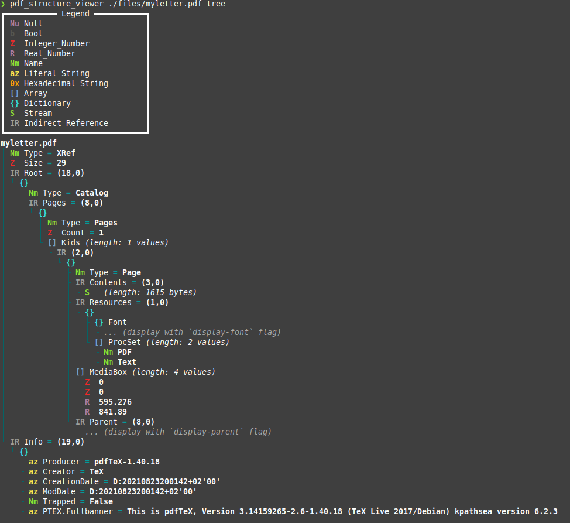

# PDF Structure Viewer
[](https://crates.io/crates/pdf_structure_viewer/)
[](https://docs.rs/pdf_structure_viewer/latest/)

Inspect how the PDF's structure looks.
This tool is useful for when working with PDFs and/or [`lopdf`][lopdf].

This application is used [`lopdf`][lopdf] internally to decode the structure of the pdf.

The output of this application is for human viewers only.
Do **NOT** use the output of this application as input for other applications.

This project was inspired by: https://pdfux.com/inspect-pdf/

This tool was developed with support from [MyEmma.nl](https://www.myemma.nl/).



## Extra info

Most people using this tool will most likely want to know more about the structure of PDFs.
Here are some links that will help with that.

PDF 1.7 or ISO 32000-1 (2008) Spec:
- [Download from adobe.com](https://www.adobe.com/content/dam/acom/en/devnet/pdf/pdfs/PDF32000_2008.pdf)
- [Download from archive.org](https://web.archive.org/web/20210128014024/https://www.adobe.com/content/dam/acom/en/devnet/pdf/PDF32000_2008.pdf)

## Install

### Through Cargo

Install from https://crates.io:
```
cargo install pdf_structure_viewer
```

Install from local repo clone:
```
cd ./pdf_structure_viewer
cargo install --path .
```

## License

The code in this project is licensed under the MIT or Apache 2.0 license.

All contributions, code and documentation, to this project will be similarly licensed.

[lopdf]: https://github.com/J-F-Liu/lopdf